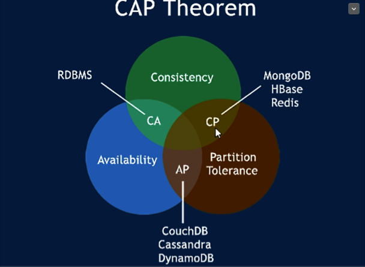
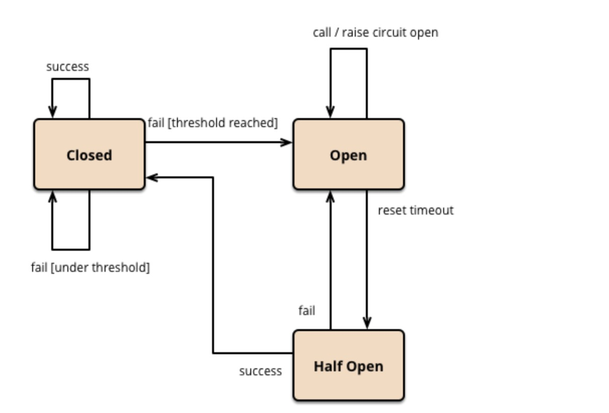
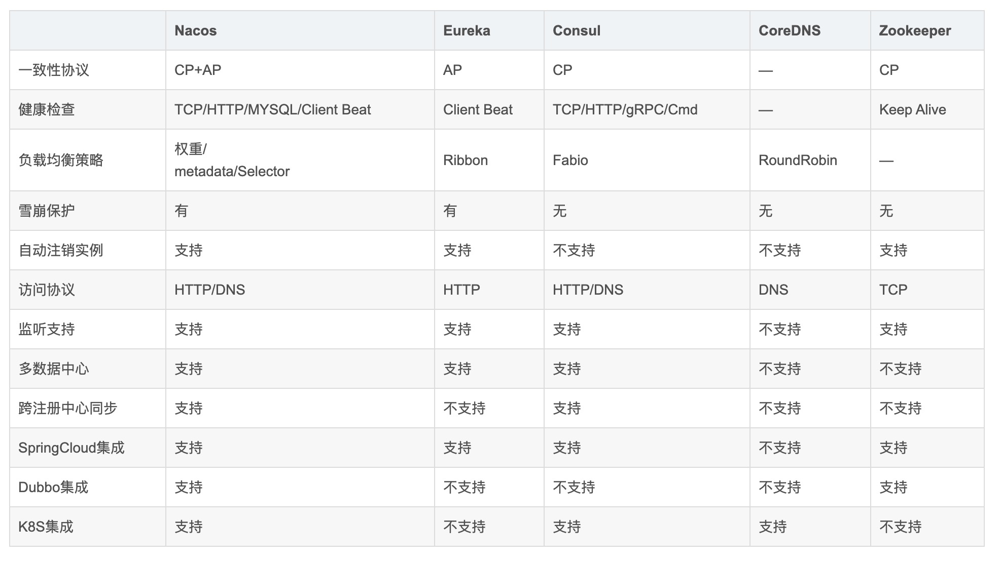
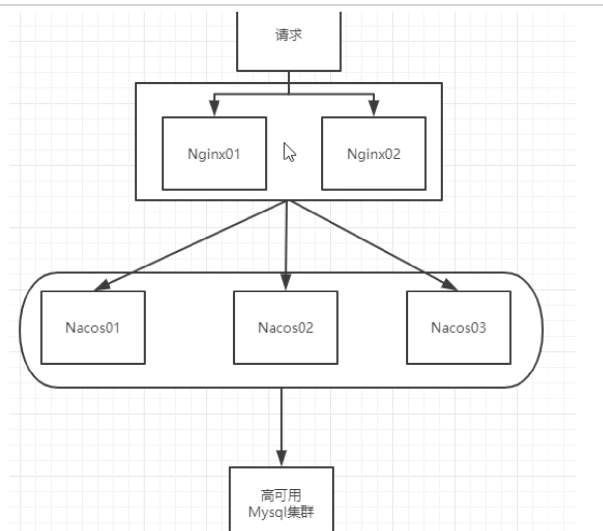
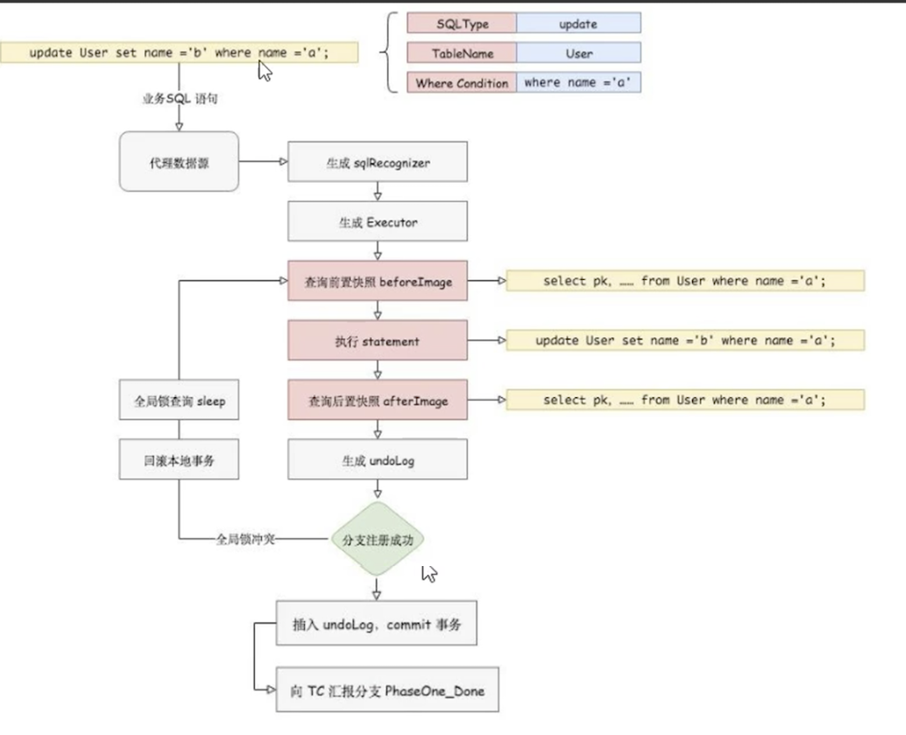

## 尚硅谷 springCloud 学习 持续更新

 [springCloud-config配置中心](https://github.com/acloudyh/springCloud-config)

## 填坑之路
[踩坑记录](https://acloudyh.github.io/categories/)

[踩坑记录CSDN](https://blog.csdn.net/yanghao937170)


脑图链接:
链接: https://pan.baidu.com/s/1NqN2yP0FfsrozJ6bIANTNQ 提取码: k7v9

 
 

## Eureka基础知识

#### 什么是服务注册与发现
    Eureka采用了CS的设计架构，Eureka Server作为服务注册功能的服务器，它是服务注册中心。而系统中的其他微服务,使用Eureka的客户端连接到Eureka Server并维持心
    跳连接。这样系统的维护人员就可以通过Eureka Server来监控系统中各个微服务是否正常运行。
 
    在服务注册与发现中，有一个注册中心。 当服务器启动的时候，会把当前自己服务器的信息比如服务地址通讯地址等以别名方式注册到注册中心上。另-方(消费者|服务提供
    者)，以该别名的方式去注册中心上获取到实际的服务通讯地址,然后再实现本地RPC调用RPC远程调用框架核心设计思想:在于注册中心，因为使用注册中心管理每个服务与
    服务之间的一个依赖关系(服务治理概念)。在任何rpc远程框架中，都会有-个注册中心(存放服务地址相关信息(接口地址)

## consul

#### Mac安装consul
- 启动
    ```
    brew install consul
    ```
- 运行
    ```shell script
    consul agent -dev
    ```
- 页面查看
    ```html
    http://localhost:8500/
    ```
## 经典CAP图
```text
    C: Consistency(强一致性)
    A: Availability(可用性)
    P: Partition tolerance(分区容错)
    CAP理论关注粒度是数据，而不是整体系统设计的策略
```
    AP(Eureka)
    
    CP(Zookeeper/Consul)

  - CAP理论的核心是: -个分布式系统不可能同时很好的满足一致性，可用性和分区容错性这三个需求,
  - 最多只能同时较好的满足两个
  
  因此，根据CAP原理将NoSQL数据库分成了满足CA原则、满足CP原则和满足AP原则三大类:
  - CA-单点集群，满足一致性，可用性的系统，通常在可扩展性上不太强大。
  - CP-满足一 致性,分区容忍必的系统，通常性能不是特别高。
  - AP -满足可用性,分区容忍性的系统，通常可能对一 致性要求低一 些。
 
    
    
## Ribbon
- 简介: 
    - Spring Cloud Ribbon 是基于Netflix实现的一套客户端负载均衡的工具; 
    - 简单的说,Ribbon是Netflix发布的开源项目,主要功能是提供客户端的软件负载均衡算法和服务调用. Ribbon客户端组件提供一系列完善的配置项,如连接超时,重试等. 简单的说,就是在配置文件中列出Load Balancer (简称LB)后面所有的机器,
    Ribbon会自动的帮助你基于某种规则(简单轮询,随机连接等)去连接这些机器.

- Ribbon 本地负载均衡客户端 VS Nginx 服务端负载均衡区别
    - Nginx是服务器负载均衡,客户端所有请求都会交给Nginx,然后由Nginx实现转发请求,即负载均衡是由服务端实现的
    - Ribbon本地负载均衡,在调用微服务接口时候,会在注册中心上获取注册信息服务列表之后缓存到JVM本地,从而在本地实现RPC远程服务调用技术.


## OpenFeign    
    Feign是一个声明式的web服务客户端，让编写web服务客户端变得非常容易，只需创建一个接口并在接口上添加注解即可
```java

//启用feign客户端
@EnableFeignClients

//定义feign客户端
@FeignClient(value = "CLOUD-PAYMENT-SERVICE")
```


## Hystrix      
#### 服务降级
- 概念: 服务降级，当服务器压力剧增的情况下，根据当前业务情况及流量对一些服务和页面有策略的降级，以此释放服务器资源以保证核心任务的正常运行; (简单来说: 服务器忙，请稍候再试，不让客户端等待并立刻返回一个友好提示，fallback)
- 哪些情况触发降级
    - 程序运行异常
    - 超时
    - 服务熔断触发服务降级
    - 线程池/信号量打满也会导致服务降级
- 注解
    ```java
      @HystrixCommand(fallbackMethod = "PaymentTimeOutFallbackMethod", commandProperties = {
                @HystrixProperty(name = "execution.isolation.thread.timeoutInMilliseconds", value = "1500")
        })
    ```
- 注意统一fallback

#### 服务熔断
    服务的降级->进而熔断->恢复调用链路
    
   [https://martinfowler.com/bliki/CircuitBreaker.html](https://martinfowler.com/bliki/CircuitBreaker.html)
   
   
    
- 概念: 如果某个目标服务调用慢或者有大量超时，此时，熔断该服务的调用，对于后续调用请求，不在继续调用目标服务，直接返回，快速释放资源; 如果目标服务情况好转则恢复调用。(简单来说: 类比保险丝达到最大服务访问后，直接拒绝访问，拉闸限电，然后调用服务降级的方法并返回友好提示)
- 熔断设计 

    三个模块：熔断请求判断算法、熔断恢复机制、熔断报警
    
    - 熔断请求判断机制算法：使用无锁循环队列计数，每个熔断器默认维护10个bucket，每1秒一个bucket，每个blucket记录请求的成功、失败、超时、拒绝的状态，默认错误超过50%且10秒内超过20个请求进行中断拦截。
    
    - 熔断恢复：对于被熔断的请求，每隔5s允许部分请求通过，若请求都是健康的（RT<250ms）则对请求健康恢复。
    
    - 熔断报警：对于熔断的请求打日志，异常请求超过某些设定则报警

- 注解 配置参数
    ```java
   @HystrixCommand(fallbackMethod = "xxx_method",
            groupKey = "strGroupCommand",
            commandKey = "strCommarld",
            threadPoolKey = "strThreadPool",
            commandProperties = {
                    //设置隔离策略，THREAD 表示线程她SEMAPHORE:信号他隔离
                    @HystrixProperty(name = "execution.isolation.strategy", value = "THREAD"),
                    //当隔离策略选择信号他隔离的时候，用来设置信号地的大小(最大并发数)
                    @HystrixProperty(name = "execution.isolation.semaphore.maxConcurrentRequests", value = "10"),
                    //配置命令执行的超时时间
                    @HystrixProperty(name = "execution.isolation.thread.timeoutinMilliseconds", value = "10"),
                    //是否启用超时时间
                    @HystrixProperty(name = "execution.timeout.enabled", value = "true"),
                    //执行超时的时候是否中断
                    @HystrixProperty(name = "execution.isolation.thread.interruptOnTimeout", value = "true"),
                    //执行被取消的时候是否中断
                    @HystrixProperty(name = "execution.isolation.thread.interruptOnCancel", value = "true"),
                    //允许回调方法执行的最大并发数
                    @HystrixProperty(name = "fallback.isolation.semaphore.maxConcurrentRequests", value = "10"),
                    //服务降级是否启用，是否执行回调函数
                    @HystrixProperty(name = "fallback.enabled", value = "true"),
                    @HystrixProperty(name = "circuitBreaker.enabled", value = "true"),
                    //该属性用来设置在滚动时间窗中，断路器熔断的最小请求数。例如，默认该值为20的时候，
                    //如果滚动时间窗(默认10秒)内仅收到了19个请求，即使这19个请求都失败了， 断路器也不会打开。
                    @HystrixProperty(name = "circuitBreaker.requestVolumeThreshold", value = "20"),
                    // 该属性用来设置在熔动时间窗中表示在滚动时间窗中，在请求数量超过
                    // circuitBreaker.requestVolumeThreshold 的情况下,如果错误请求数的百分比超过50,
                    //就把断路器设置为“打开”状态，否则就设置为“关闭”状态。
                    @HystrixProperty(name = "circuitBreaker.errorThresholdPercentage", value = "50"),
                    // 该属性用来设置当断路器打开之后的休眠时间窗。休眠时间窗结束之后,
                    //会将断路器置为"半开”状态，尝试熔断的请求命令，如果低然失败就将断路器继续设置为"打开”状态，
                    //如果成功就设置为"关闭”状态。
                    @HystrixProperty(name = "circuitBreaker.sleepWindowinMilliseconds", value = "5009"),
                    //断路器强制打开
                    @HystrixProperty(name = "circuitBreaker.force0pen", value = "false"),
                    // 断路器强制关闭
                    @HystrixProperty(name = "circuitBreaker.forceClosed", value = "false"),
                    //滚动时间窗设置，该时间用于断路器判断健康度时需要收集信息的持续时间
                    @HystrixProperty(name = "metrics.rollingStats.timeinMilliseconds", value = "10000"),
                    //该属性用来设置滚动时间窗统计指标信息时划分”桶"的数量，断路器在收集指标信息的时候会根据设置的时间窗长度拆分成多个"相"来累计各度量值，每个”桶"记录了-段时间内的采集指标。
                    //比如10秒内拆分成10个”桶"收集这样，所以timeinMilliseconds 必须能被numBuckets 整除。否则会抛异常
                    @HystrixProperty(name = "metrics.rollingStats.numBuckets", value = "10"),
                    //该属性用来设置对命令执行的延迟是否使用百分位数来跟踪和计算。如果设置为false,那么所有的概要统计都将返回-1.
                    @HystrixProperty(name = "metrics .rollingPercentile.enabled", value = "false"),
                    //该属性用来设置百分位统计的滚动窗口的持续时间， 单位为毫秒。
                    @HystrixProperty(name = "metrics.rollingPercentile.timeInMilliseconds", value = "60000"),
                    //该属性用来设置百分位统计演动窗口中使用“桶”的数量。
                    @HystrixProperty(name = "metrics.rollingPercentile.numBuckets", value = "60000"),
                    // 该属性用来设置在执行过程中每个 “桶”中保留的最大执行次数。如果在滚动时间窗内发生超过该设定值的执行次数，就从最初的位置开始重写。例如，将该值设置为100,燎动窗口为10秒， 若在10秒内一 一个“桶 ” 中发生7500次执行，
                    //那么该“桶”中只保留最后的100次执行的统计。另外,增加该值的大小将会增加内存量的消耗， 并增加排序百分位数所需的计算
                    @HystrixProperty(name = "metrics.rollingPercentile.bucketSize", value = "100"),
                    //该属性用来设置采集影响断路器状态的健康快照(请求的成功、错误百分比) 的间隔等待时间。
                    @HystrixProperty(name = "metrics.healthSnapshot.intervalinMilliseconds", value = "500"),
                    //是否开启请求缓存
                    @HystrixProperty(name = "requestCache.enabled", value = "true"),
                    // HystrixCommand的执行和时间是否打印日志到HystrixRequestLog中
                    @HystrixProperty(name = "requestLog.enabled", value = "true"),
            },
            threadPoolProperties = {
                    //该参数用来设置执行命令线程他的核心线程数，该值 也就是命令执行的最大并发量
                    @HystrixProperty(name = "coreSize", value = "10"),
                    //该参数用来设置线程她的最大队列大小。当设置为-1时，线程池将使用SynchronousQueue 实现的队列，
                    // 否则将使用LinkedBlocakingQueue实现队列
                    @HystrixProperty(name = "maxQueueSize", value = "-1"),
                    // 该参数用来为队列设置拒绝阀值。 通过该参数， 即使队列没有达到最大值也能拒绝请求。
                    //該参数主要是対linkedBlockingQueue 队列的朴充,因为linkedBlockingQueue
                    //队列不能动态修改它的对象大小，而通过该属性就可以调整拒绝请求的队列大小了。
                    @HystrixProperty(name = "queueSizeRejectionThreshold", value = "5"),
            }
    )
    ```
#### 服务限流
- 概念: 限流模式主要是提前对各个类型的请求设置最高的QPS阈值，若高于设置的阈值则对该请求直接返回，不再调用后续资源(简单来说: 秒杀高并发等操作，严禁一窝蜂的过来拥挤，大家排队，一秒钟N个，有序进行)

***参考alibaba的Sentinel***

#### Hystrix工作流程
    
   [b站视频P62](https://www.bilibili.com/video/BV18E411x7eT?p=62)
    
   
   
   
   
### SpringCloud Gateway
#### SpringCloud Gateway 特性
- 基于Spring Framework 5, Project Relactor和Spring Boot 2.0进行构建;
- 动态路由:能够匹配任何请求属性;
- 可以对路由指定Predicate (断言)和Filter (过滤器) ;
- 集成Hystrix的断路器功能;
- 集成Spring Cloud服务发现功能;
- 易于编写的Predicate (断言)和Filter (过滤器) ;
- 清求限流功能;
- 支持路径重写。
#### SpringCloud Gateway 和zuul区别

在SpringCloud Finchley正式版之前，Spring Cloud推荐的网关是Netflix提供的Zuul:
 1. Zuul 1.x, 是-个基于阻塞I/ 0的API Gateway
 2. Zuul 1.x基于Servlet 2. 5使用阻塞架构它不支持任何长连接(如WebSocket) Zuul的设计模式和Nginx较像，每次|/ 0操作都是从工作线程中选择一个执行, 请求线程被阻塞到工作线程完成，但是差别是Nginx用C++实现，Zuul 用Java实现，而JVM本身会有第-次加载较慢的情况，使得Zuul的性能相对较差。
 3. Zuul 2.x理念更先进,想基于Netty非阻塞和支持长连接,但SpringCloud目前还没有整合。Zuul 2.x的性能较Zuul 1.x 有较大提升。在性能方面，根据官方提供的基准测试，Spring Cloud Gateway的RPS (每秒请求数)是Zuul 的1.6倍。
 4. Spring Cloud Gateway建立在Spring Framework 5、Project Reactor和Spring Boot2之上，使用非阻塞API。
 5. Spring Cloud Gateway还支持WebSocket,并且与Spring紧密集成拥有更好的开发体验
 
### 消息总线

#### Rabbit MQ

1. 安装

 [官网安装方式](https://www.rabbitmq.com/install-homebrew.html)
 ```shell script
 brew install rabbitmq
 ```

2. 修改配置

 vim  ~/.zshrc 
 ```shell script
 # RabbitMQ Config
 export PATH=$PATH:/usr/local/sbin
 ```

3. 启动
```shell script
➜  ~ rabbitmq-server
Configuring logger redirection

  ##  ##      RabbitMQ 3.8.8
  ##  ##
  ##########  Copyright (c) 2007-2020 VMware, Inc. or its affiliates.
  ######  ##
  ##########  Licensed under the MPL 2.0. Website: https://rabbitmq.com

  Doc guides: https://rabbitmq.com/documentation.html
  Support:    https://rabbitmq.com/contact.html
  Tutorials:  https://rabbitmq.com/getstarted.html
  Monitoring: https://rabbitmq.com/monitoring.html

  Logs: /usr/local/var/log/rabbitmq/rabbit@localhost.log
        /usr/local/var/log/rabbitmq/rabbit@localhost_upgrade.log

  Config file(s): (none)

  Starting broker... completed with 6 plugins.
```

4. 登录查看
 http://localhost:15672
 账号密码:guest
 
## Spring Cloud Alibaba

   [官网](https://spring.io/projects/spring-cloud-alibaba)
   
   [github中文文档](https://github.com/alibaba/spring-cloud-alibaba/blob/master/README-zh.md)
   
   [github英文文档](https://spring-cloud-alibaba-group.github.io/github-pages/greenwich/spring-cloud-alibaba.html)
   
### Nacos

1. 简介
   - Nacos 相当于注册中心+配置中心的组合 ===> Nacos=Eureka+Config+Bus
   - [官网](https://nacos.io/zh-cn/)

2. 安装
   [参考官网](https://nacos.io/zh-cn/docs/quick-start.html)

3. nacos与其它注册中心特新对比

   
   
4. Nacos支持AP和CP模式的切换

  - C是所有节点在同一时间看到的数据是一致的; 而A的定义是所有的请求都会收到响应。
  - 何时选择使用何种模式?
      - 如果不需要存储服务级别的信息且服务实例是通过nacos- cdient注册，并能够保持心跳上报,那么就可以选择AP模式。当前主流的服务如Spring cloud和Dubbo服务,都适
      用于AP模式，AP模式为了服务的可能性而减弱了一致性, 因此AP模式下只支持注册临时实例。
      - 如果需要在服务级别编辑或者存储配置信息，那么CP是必须，K8S服务和DNS服务则适用于CP模式。
      CP模式下则支持注册持久化实例，此时则是以Raft协议为集群运行模式，该模式下注册实例之前必须先注册服务，如果服务不存在，则会返回错误。
  - 如何切换
  ```shell script
    curl -X PUT '$NACOS_SERVER:8848/nacos/v1/ns/operator/switches?entry=serverMode&value=CP'
``` 

### Nacos持久化配置
1. 说明
  - [官网链接](https://nacos.io/zh-cn/docs/cluster-mode-quick-start.html)
  - 架构图等价于
    
    
2. derby切换mysql脚本
   [nacos-mysql.sql脚本](nacos-mysql.sql)
   
3. 修改application.properties,并重启nacos

```
    spring.datasource.platform=mysql
    
    db.num=1
    db.url.0=jdbc:mysql://11.162.196.16:3306/nacos_devtest?characterEncoding=utf8&connectTimeout=1000&socketTimeout=3000&autoReconnect=true
    db.user=nacos_devtest
    db.password=youdontknow
```

## Nacos集群配置及Nginx反向代理
## 安装Nacos

**前提是需要一个虚拟机，本文基于CentOS 7**

[CSDN同步更新了](https://blog.csdn.net/yanghao937170/article/details/108750824)
1. 下载Nacos

    [下载地址](https://github.com/alibaba/nacos/releases/tag/1.3.2)
2. 配置Nacos
    - 创建mynacos文件夹；将tar包解压到mynacos文件夹中
	- 配置cluster.conf

	    ```powershell
	   cp cluster.conf.example cluster.conf
	   vim cluster.conf
	     ```
	- 添加以下内容(根据自己的**主机ip**来填)
 
	    ```
	    192.168.81.129:3333
	    192.168.81.129:4444
	    192.168.81.129:4444
	    ```
 
	- 修改数据库文件,**vim application.properties**
 
        ```
       spring.datasource.platform=mysql
       db.num=1
       db.url.0=jdbc:mysql://127.0.0.1:3306/nacos_config?characterEncoding=utf8&connectTimeout=1000&socketTimeout=3000&autoReconnect=true
       db.user=root
       db.password=6yhn^YHN
        ```

	- 关闭防火墙或者开放端口（为了省事，我关闭了和防火墙）
	    ```powershell
	    systemctl stop firewalld
	    ```
	
3. 启动Nacos
    **TIPS：因为是一台机器，所以以多个实例来设置集群，以端口区分，需要启动三个nacos；如果是多台机器那就正常一个机器起一个nacos即可**
    - 复制**startup.sh**

         ```powershell
          cp startup.sh.bak startup-3333.sh
          cp startup.sh.bak startup-4444.sh
          cp startup.sh.bak startup-5555.sh
         ```
    - 修改**vim startup-3333.sh**（一个示例，4444和5555 都按照此修改）,增加**-Dserver.port=3333**启动时指定端口号
    
        ```powershell
         # start
         echo "$JAVA ${JAVA_OPT}" > ${BASE_DIR}/logs/start.out 2>&1 &
         nohup $JAVA -Dserver.port=3333 ${JAVA_OPT} nacos.nacos >> ${BASE_DIR}/logs/start.out 2>&1 &
         echo "nacos is starting，you can check the ${BASE_DIR}/logs/start.out"
        ```
	
	- 启动nacos
	
        ```powershell
       ./startup-3333.sh
       ./startup-4444.sh
       ./startup-5555.sh
        ```
	 
## 安装Nginx

贴个安装nginx教程，并且配置stream负载均衡 [转向网址](http://xiaohost.com/2754.html)

1. 配置Nginx
    由于我是yum安装的Nginx 配置文件 **vim /etc/nginx/nginx.confg**
    - 设置upstream cluster
    - 设置location根路径。**proxy_pass http://cluster;**
    
    ``` 
    #gzip  on;
    upstream cluster{
        server 192.168.81.129:3333;
        server 192.168.81.129:4444;
        server 192.168.81.129:5555;
    }
    server {
        listen       1111;
        server_name  localhost;

        #charset koi8-r;

        #access_log  logs/host.access.log  main;

        location / {
            root   html;
            index  index.html index.htm;
            proxy_pass http://cluster;
        }
    ```
    
1. 启动Nginx
    
    ```
    systemctl start nginx.service
    ```
2. 登录查看[http://192.168.81.129:1111/nacos/#/login](http://192.168.81.129:1111/nacos/#/login)


## Seata

1. 所需的建表语句以及项目中的[初始化脚本sql](seata-project-undo_log.sql)
2. 实现示例
    
   
   
   
   
   
   
